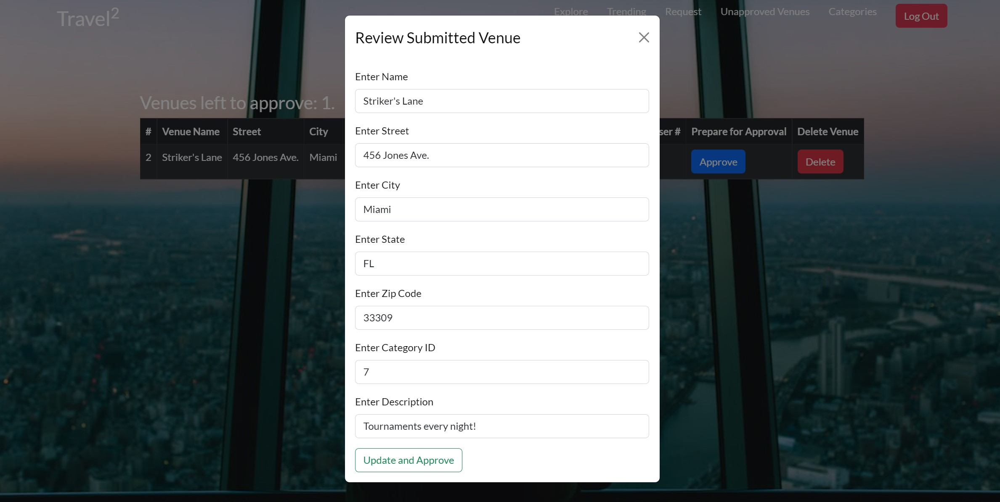

# Travel²

Deployed site: https://travel-two.gitlab.io/travel-two

Note: Authentication system uses a library called JWTDown-FastAPI, which uses cross-site tracking. This is disabled by default on iOS Safari settings. The homepage requires requires querying for token data. With a free plan on Render.com, requests, especially authentication, are very slow. Thus the home page may take a couple of seconds before loading for the first time.

Want to try the admin view?

username: admin\
password: travelsquared

## Group Members

Muhammad Rahman\
Lena Zhang\
Sarah Ahn\
Rosario Davi

## Design

## Intended market

Travel² is a social traveling based application that is aimed to connect travelers and help expand their itinerary with suggestions on places they have never thought about exploring before. Our website contains an explore page where users can follow other users and be notified of their most recent venue post along with a trending page for reviews on a venue. Users can utilize the search bar to narrow down recommendations by city and state of the location they intend on visiting. In addition, users can also make post in regards to asking for recommendations and have other users reply in the form of comments.

## Built With

React\
Redux\
Bootstrap\
FastAPI\
PostgreSQL\
Python\
JavaScript

## Functionality

Navigation bar: For users to sign up, login, and logout. In addition to navigating to other pages such as the explore, trending, and request page.

Explore: Venue cards with the ability to check out reviews for the venue and creating a review if logged in.

Trending: A page that populates all the most recent reviews made for a venue

Request: Users can request for places to try in a new city and give each other suggestions if logged in. Viewing requests and comments does not require an account.

Unapproved venues: Admins will be able to approve or deny newly created venues before they show up for the first time based on accuracy and appropriateness.

Categories: Only admins are able to generate new categories for venues.

To make an admin account to approve submitted venues, when signing up, make the username "admin".

## Visuals

### Landing Page

### Signup

### Login

### Searching Venues

### Viewing Reviews

### Creating Reviews

### View Trending, Recent Reviews

### Submitting Venue

### Submitting Requests

### Viewing Comments

### Admin Landing Page

### Adding Categories

### Approving Venues

## Testing

fastapi-traveltwo\tests\test_account.py - Muhammad Rahman\
fastapi-traveltwo\tests\test_request.py - Lena Zhang\
fastapi-traveltwo\tests\test_review.py - Sarah Ahn\
fastapi-traveltwo\tests\test_venue.py - Rosario Davi\

## Start up

To grab the project:

Fork and clone the repository from https://gitlab.com/travel-two/module3-project-gamma.

You can open the project in VScode to see the code.

To review the running project:

Start by opening docker and your terminal.

Run these commands in this order:

docker volume create postgres-data
docker volume create pg-admin

For PC run docker-compose build
For Mac run DOCKER_DEFAULT_PLATFORM=linux/amd64 docker-compose build

Lastly, run docker-compose up.

All containers should be running now.

Once containers are up and running, visit localhost:3000 to view the website. You can also checkout FastAPI's endpoints at localhost:8000/docs.

To run tests, enter the travel-squared container or directory and use the command:

python -m pytest inside the travel-squared container.

## Stretch Goals Functionality

Follower/following system.\
Add photos to go along with each category so venue cards show a different picture for its given category (since we don’t have photos being submitted with a create venue).\
Websocket support for messaging between users.\
Dashboard panel that consolidates unapproved venues and categories pages into one component.\
Transition away from JWTDown for FastAPI, which relies on cross-site tracking. Safari blocks this by default. This means authentication won't work on iPhone, unless the user manually changes the setting.\

### Other files

The following project files have been created as a minimal
starting point. Please follow the guidance for each one for
a most successful project.

- `docker-compose.yaml`: there isn't much in here, just a
  **really** simple UI and FastAPI service. Add services
  (like a database) to this file as you did with previous
  projects in module #2.
- `.gitlab-ci.yml`: This is your "ci/cd" file where you will
  configure automated unit tests, code quality checks, and
  the building and deployment of your production system.
  Currently, all it does is deploy an "under construction"
  page to your production UI on GitLab and a sample backend
  to Render.com. We will learn much more about this file.
- `.gitignore`: This is a file that prevents unwanted files
  from getting added to your repository, files like
  `pyc` files, `__pycache__`, etc. We've set it up so that
  it has a good default configuration for Python projects.

## How to complete the initial deploy

There will be further guidance on completing the initial
deployment, but it just consists of these steps:

### Setup GitLab repo/project

- add these GitLab CI/CD variables:
  - PUBLIC_URL : this is your gitlab pages URL
  - SAMPLE_SERVICE_API_HOST: enter "blank" for now

#### Your GitLab pages URL

You can't find this in GitLab until after you've done a deploy
but you can figure it out yourself from your GitLab project URL.

If this is your project URL

https://gitlab.com/GROUP_NAME/PROJECT_NAME

then your GitLab pages URL will be

https://GROUP_NAME.gitlab.io/PROJECT_NAME

### Create render.com account and application

- create account on render.com
- one person create a group and invite all other members
- create a new "Web Service"
  - authenticate with GitLab and choose your project
  - Enter fields:
    - Name: name of your service
    - Root Directory: the directory of your service in your git repo.
      For this example use "sample_service".
    - Environment: Docker
    - Plan Type: Free
  - click the "Create Web Service" button to create it
  - the build will succeed and it will look like the server is running,
    most likely, in 6-10 minutes, it will fail.
  - click "Manual Deploy" -> "Deploy latest commit" and the service
    should deploy successfully.

### Update GitLab CI/CD variables

Copy the service URL for your new render.com service and then paste that into the value for the SAMPLE_SERVICE_API_HOST CI/CD variable in GitLab.

### Deploy it

Merge a change into main to kick off the initial deploy. Once the build pipeline finishes you should be able to see an "under construction" page on your GitLab pages site.
